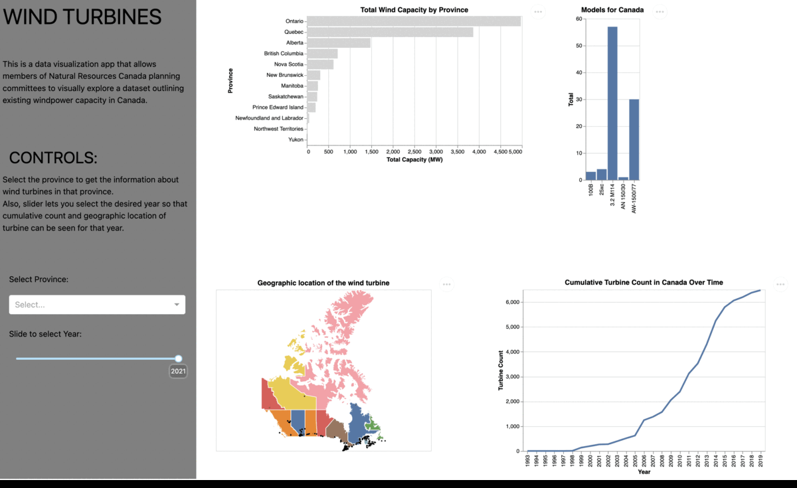

# Wind Turbines (Group C)

- We are planning to create a dashboard which will record the number of turbines in different provinces of Canada. It will answer two of our major research questions which are as mentioned below:

1. Number of wind turbines in Canada province vise
2. Number of wind turbines installed on yearly basis

Link to access our deployed app:

- Aishwarya Sharma : https://windturbineapp.herokuapp.com/

- Sean Casey: https://data551-dash-app.herokuapp.com/

- LingXiang Zou: https://data551-group-c-dashboard.herokuapp.com

- Tingwen Hua: https://project551dashboard.herokuapp.com/

Also, the dashboard will let the user know the number of different models in a particular province, locations of the turbines in a particular province.

## Team Members

- Aishwarya Sharma: A data science enthusiast who loves to play with data and is always eager to explore more.
- LingXiang Zou: A data science student who loves hiking and video gaming.
- Sean Casey: Software developer and data science student who likes biking, skiing, and cooking in his spare time.
- Tingwen Hua: A data science student who loves handcrafting and travelling.

## Description

The growth and development of renewable energy sources as replacements for fossil fuels is an important aspect of combatting climate change. In order to develop Canada's national strategy for renewable energy production in Canada, it is important to understand the current situation and the history of existing wind power production in Canada. To accomplish this, we propose building a data visualization app that allows members of Natural Resources Canada planning committees to visually explore a dataset outlining existing windpower capacity in Canada. Our dashboard will show the different variables that contribute to the overall existing windpower capacity within Canada, and allow the user to filter on different variables to explore different aspects of the data.   

## About this Dashboard

Our application will contain a dashboard which will reflect the total count of models available province vice in Canada along with the total count of wind turbines in the selected province as per the chosen year. In addition to this, we will be adding a graphical representation of the location of the turbines in the selected province. The overall capacity of the wind turbines in Canada could also be seen which would give a wider picture of the capacity of the turbines in each province in Canada.

The dashboard will include different visualizations like bar chart, map, line chart etc. There will be two drop downs for year and province. User can select the desired year and province and the data corresponding to the selection will be reflected. This dashboard will answer the research questions mentioned above. It will be a user friendly application and can be used to analyze the wind turbines in Canada using different representations. 

Different visualizations and a small summary corresponding to them are as mentioned below:

**BAR CHART FOR MODELS IN SELECTED PROVINCE:** This will display the total number of different models of turbines in the selected province.

**TURBINE COUNT AS PER YEAR:** This is a line graph which will display the total number of turbines which have changed over the years for a particular province.

**LOCATION OF WIND TURBINE:** This is a map of a particular province and will depict the locations of the turbines in a particular province/ territory.

**TOTAL CAPACITY OF TURBINES** This is a bar graph which will display the total capacity of turbines for different provinces in Canada.

## Description of Data set

We will be visualizing a dataset of approximately 6,500 existing wind power turbines in Canada. Each turbine entry has 13 different numerical and categorical variables that describe the location within Canada (province/territory, latitude, longitude), the project to which the turbine belongs (project name, total project capacity, number within project), and the turbine itself (turbine id, rated 
capacity, rotor diameter, hub height, manufacturer, model, and commissioning year). Using this data, we will be able to calculate new aggregated variable such as total power capacity per province, and yearly total cumulative turbine count. 

## Note to those who are interesting in helping us develop our dashboard

If someone wants to contribute in our dashboard feel free to do so. You can reach out to us via emails. Contributors are always welcome and you can access our application by following the simple steps are as mentioned below:

- Our Git repository is public so you can directly clone it using the link: 
- We have created a virtual environment, so install that as well. Name of our virtual environment is 'venv'.
- Our main code runs from server.py file. So, open the terminal on your local machine and go to the folder 'src'.
- Run the command 'python server.py' there.
- Open the link http://localhost:8050/. On this link, you can see the dashboard for better understanding.

We would like contributors to help us in making the app more advanced by suggesting changes with respect to the predictions about the wind turbines in future.

## Acknowledgements and references 

Dataset has been taken from the following link:
https://open.canada.ca/data/en/dataset/79fdad93-9025-49ad-ba16-c26d718cc070/resource/95937fc5-879c-4868-87ba-cd5ce48bfadf
